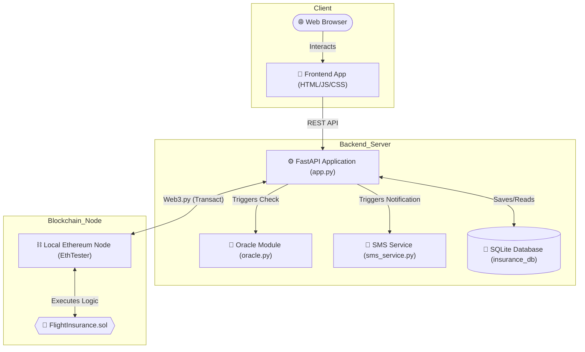
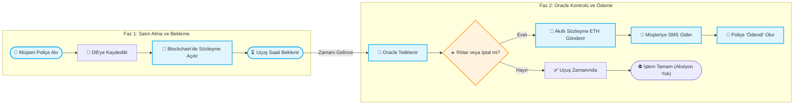

<div align="center">
  
  <h1>🛫 Decentralized Flight Insurance dApp</h1>
  <p><strong>A Blockchain-powered Smart Insurance System for Flight Delays and Cancellations</strong></p>

  <p>
    
    
    
    
    
  </p>
</div>

---

## 🎯 Projenin Amacı (Overview)
Bu proje, yolcuların uçuş gecikmelerine veya iptallerine karşı **Ethereum** (Kripto para) teminatlı akıllı sözleşmeler aracılığıyla sigorta alabilmelerini sağlayan hibrit bir Web3/Web2 uygulamasıdır. Uçuşunuz rötar yaparsa, akıllı sözleşme insani onaya (ve bürokrasiye) gerek kalmadan poliçe bedelini anında cüzdanınıza iade eder!

---

## ⚙️ Sistem Mimarisi & Topoloji

Aşağıdaki topoloji, Web2 arayüzleriyle Web3 (Blockchain) ve Dış Servis (Oracle) bileşenlerinin nasıl uçtan uca haberleştiğini gösterir:



---

## 🛠️ Nasıl Çalışır? (İş Akışı)

Sistem mimarisi, *satın alma* ve *tazminat ödeme* olmak üzere iki ana faza ayrılmıştır:



---

## 🚀 Kurulum & Çalıştırma Yönergesi

### 1️⃣ Backend'i Başlatmak
Terminalden proje dizinindeki **backend** klasörüne geçin ve sanal ortamı aktif ettikten sonra Uvicorn'u başlatın:
```bash
# Sanal Ortam Aktifleştirme (Windows)
..\venv\Scripts\activate

# Backend sunucusunu başlatma
uvicorn app:app --reload
```
> 💡 API sunucusu `http://localhost:8000` adresinde ayağa kalkacak ve **Solidity akıllı sözleşmesi otomatik olarak derlenip** yerel ağda (EthTester) oluşturulacaktır.

### 2️⃣ Frontend'i Çalıştırmak
Yeni bir terminal açın ve genel kök dizinden **frontend** klasörüne geçin:
```bash
cd frontend
python -m http.server 8080
```
> 🌐 Tarayıcınızdan `http://localhost:8080` adresine giderek dApp (Kullanıcı Paneli) arayüzünü görüntüleyebilir ve hemen poliçe satın alabilirsiniz.

---

## 🔒 Güvenlik & İşlem Maliyeti Mimarisi
* Müşteriye ait veriler (telefon, işlem durumu vb.) işlem maliyetini artırmamak için **SQLite** veritabanında Off-Chain olarak tutulur.
* Finansal kilit işlemleri, teminat tutarları ve parayı serbest bırakma mantığı ise sadece manipüle edilemeyen **On-Chain (Ethereum Sözleşmesi)** üzerinde şeffaf bir şekilde gerçekleşir. 
